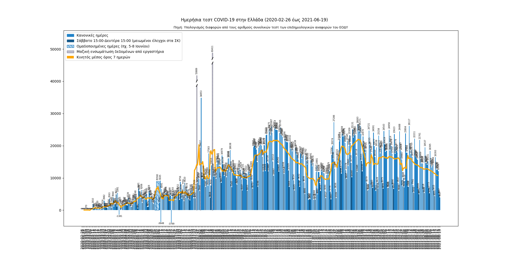

# Chart of COVID-19 tests in Greece
[[Ελληνικά]](README.md)

### Source?
The [covid19response.gr API](https://covid-19-greece.herokuapp.com/) which gets its data from the [Greek Wikipedia page](https://el.wikipedia.org/wiki/%CE%A0%CE%B1%CE%BD%CE%B4%CE%B7%CE%BC%CE%AF%CE%B1_%CF%84%CE%BF%CF%85_%CE%BA%CE%BF%CF%81%CE%BF%CE%BD%CE%BF%CF%8A%CE%BF%CF%8D_%CF%83%CF%84%CE%B7%CE%BD_%CE%95%CE%BB%CE%BB%CE%AC%CE%B4%CE%B1_%CF%84%CE%BF_2020#%CE%A3%CF%84%CE%B1%CF%84%CE%B9%CF%83%CF%84%CE%B9%CE%BA%CE%AC_%CF%83%CF%84%CE%BF%CE%B9%CF%87%CE%B5%CE%AF%CE%B1) which gets its data from the Greek [NPHO](https://eody.gov.gr/epidimiologika-statistika-dedomena/ektheseis-covid-19/). The daily number of tests is determined by calculating the differences between the daily reported numbers of total tests.

### How often is this updated?
The NPHO daily reports are issued at or around 18:00 local time. The Wikipedia article and the API usually need a day to update their data and the image above is updated automatically ~5 minutes after the API does.

### Why are there days with a negative number of tests? Why is this chart different from the one in NPHO reports?
I don't really know. [Mail me](mailto:diamaltho@gmail.com) if you've read something.

### What happened in June 3-8?
The NPHO had decided to change its report frequency from daily to weekly so the data concerns multiple days (the decision was quickly reversed nevertheless).

### Are tests in weekends reduced?
Yes, by ~33% of the average number of tests, as calculated for the March 12—July 25 period.

This concerns the Saturday 15:00—Monday 15:00 timespan (local time) as reported by the Sunday and Monday reports.

### [License](LICENSE.txt)

