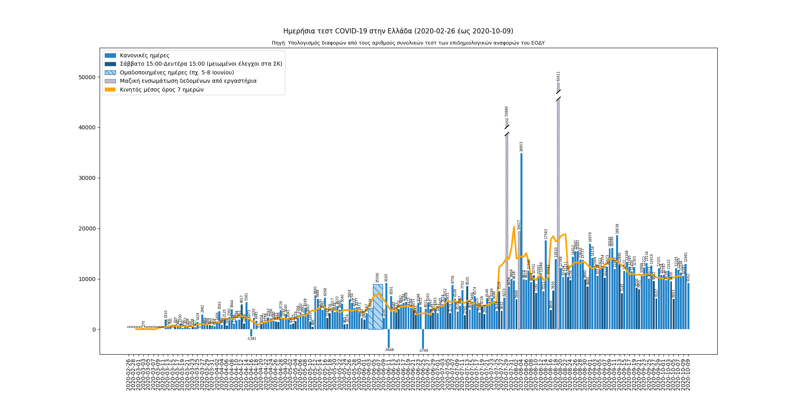

# Γράφημα των τεστ COVID-19 στην Ελλάδα
[[English]](README.en.md)

### Πηγή;
Το [API του covid19response.gr](https://covid-19-greece.herokuapp.com/) που παίρνει τα δεδομένα από τη [σελίδα της Βικιπαίδειας](https://el.wikipedia.org/wiki/%CE%A0%CE%B1%CE%BD%CE%B4%CE%B7%CE%BC%CE%AF%CE%B1_%CF%84%CE%BF%CF%85_%CE%BA%CE%BF%CF%81%CE%BF%CE%BD%CE%BF%CF%8A%CE%BF%CF%8D_%CF%83%CF%84%CE%B7%CE%BD_%CE%95%CE%BB%CE%BB%CE%AC%CE%B4%CE%B1_%CF%84%CE%BF_2020#%CE%A3%CF%84%CE%B1%CF%84%CE%B9%CF%83%CF%84%CE%B9%CE%BA%CE%AC_%CF%83%CF%84%CE%BF%CE%B9%CF%87%CE%B5%CE%AF%CE%B1) η οποία παίρνει τα δεδομένα από τον [ΕΟΔΥ](https://eody.gov.gr/epidimiologika-statistika-dedomena/ektheseis-covid-19/). Ο ημερήσιος αριθμός τεστ υπολογίζεται από τις διαφορές των αριθμών συνολικών τεστ των ημερήσιων αναφορών.

### Πόσο συχνά ανανεώνεται;
Ο ΕΟΔΥ εκδίδει τις αναφορές περίπου στις 18:00 κάθε μέρα. Το άρθρο στη Βικιπαίδεια, άρα και το API, συνήθως χρειάζονται μία ημέρα για να ανανεώσουν τα δεδομένα τους, ενώ η παραπάνω εικόνα ανανεώνεται αυτόματα ~5 λεπτά μετά το API.

### Γιατί υπάρχουν μέρες με αρνητικό αριθμό τεστ; Γιατί αυτό το γράφημα διαφέρει από αυτό που υπάρχει στις αναφορές του ΕΟΔΥ;
Δεν ξέρω. [Στείλτε μου ένα mail](mailto:diamaltho@gmail.com) αν έχετε διαβάσει κάτι σχετικό.

### Τι συνέβη στις 3-8 Ιουνίου;
Ο ΕΟΔΥ αποφάσισε να αλλάξει τη συχνότητα των αναφορών από ημερήσιες σε εβδομαδιαίες οπότε εκείνα τα δεδομένα αφορούν πολλαπλές ημέρες (αν και τελικά η απόφαση αναιρέθηκε σύντομα).

### Είναι όντως μειωμένα τα τεστ το Σαββατοκύριακο;
Ναι, κατά ~33% του μέσου αριθμού τεστ, όπως υπολογίστηκε για το διάστημα 12 Μαρτίου-25 Ιουλίου.

Ως τεστ Σαββατοκύριακου εννοούνται αυτά μεταξύ Σαββάτου 15:00-Δευτέρας 15:00, όπως παρουσιάζονται στις αναφορές της Κυριακής και της Δευτέρας.

### [Άδεια διάθεσης](LICENSE.txt)

